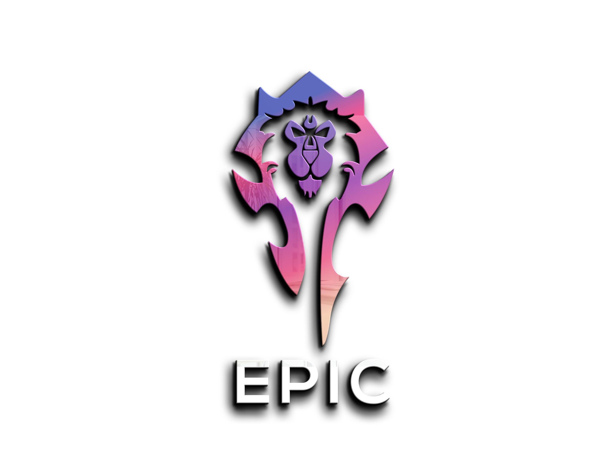

# Epic

Feel free to join our [Discord](https://discord.gg/SAZmqEYXwc).

Quality Feedback is highly appreciated!

## Supported Rotations

| Class        | Specs                                                                               |                                                                                 |                                                                                       |                                                                               |
| :----------- |:------------------------------------------------------------------------------------|:--------------------------------------------------------------------------------|:--------------------------------------------------------------------------------------|-------------------------------------------------------------------------------|
| Death Knight |                            |                        |                            |                                                                               |
| Demon Hunter |                    |        |                                                                                       |                                                                               |
| Druid        |                |                |                |  |
| Evoker       |        |  |  |                                                                                       |                                                                               |
| Hunter       |  |  |                |                                                                               |
| Mage         |                          |                          |                      |                                                                               |
| Monk         |          |      |                    |                                                                               |
| Paladin      |          |    |                        |                                                                               |
| Priest       |                  |              |                        |                                                                               |
| Rogue        |            |              |                |                                                                               |
| Shaman       |                    |    |                  |                                                                               |
| Warlock      |          |      |          |                                                                               |
| Warrior      |                      |                  |            |                                                                               |

 - The rotation does have an optimal profile and released.\
 - The rotation is not yet released.

